# Тестування працездатності системи

## Запуск сервера

## Тестування для опитувань

### POST /quizzes

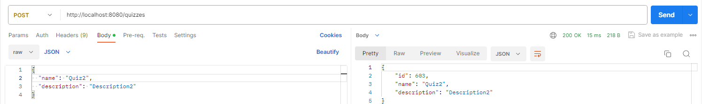

### GET /quizzes

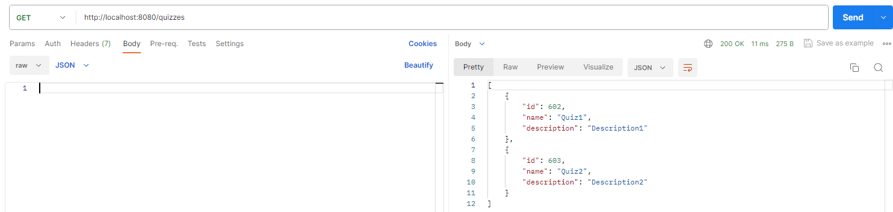

### PUT /quizzes/:id

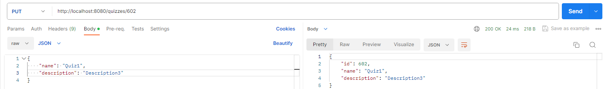

### GET /quizzes/:id

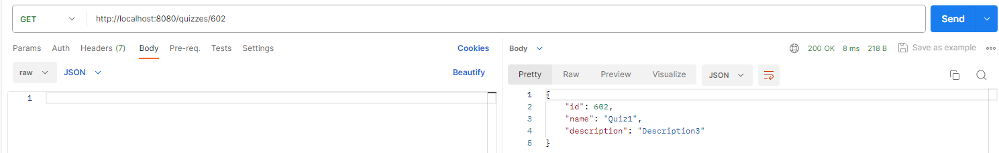

### DELETE /quizzes/:id

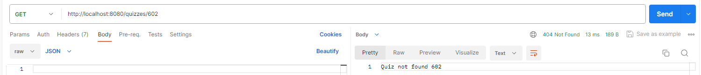

## Тестування для питань

### POST /questions

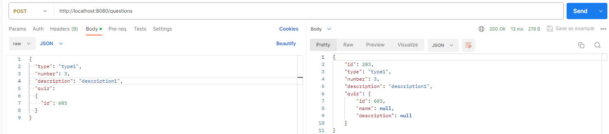

### GET  /questions

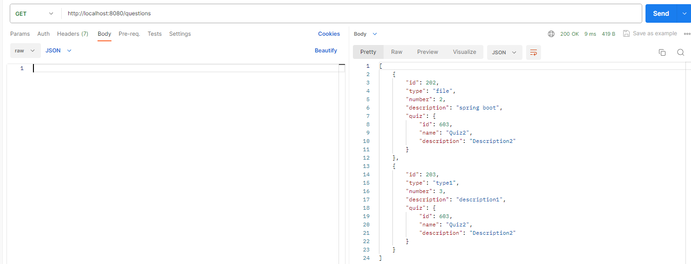

### PUT  /questions/:id

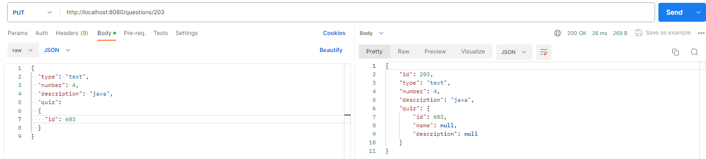

### GET  /questions/:id

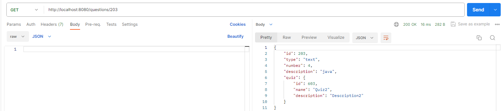

### DELETE  /questions/:id

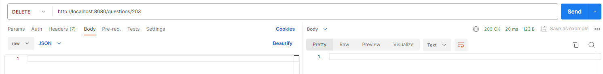
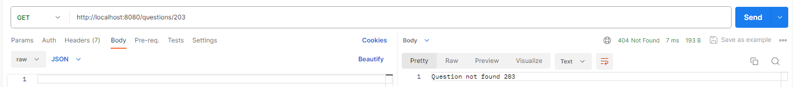

