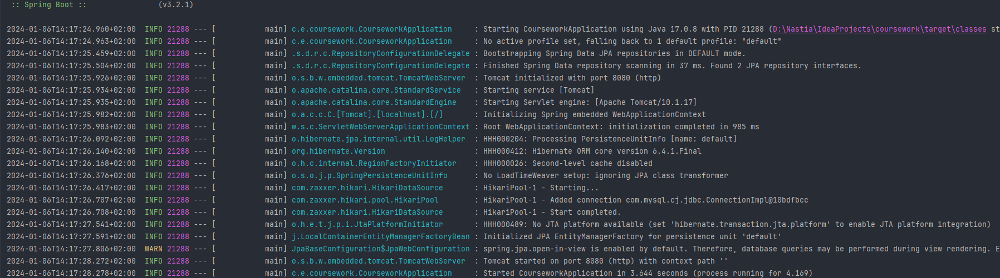
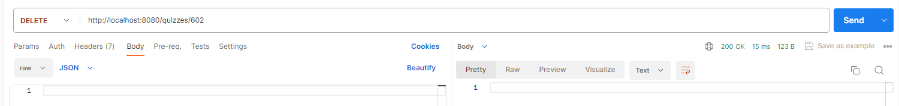

# Тестування працездатності системи

## Запуск сервера

## Тестування для опитувань

### POST /quizzes

### GET /quizzes

### PUT /quizzes/:id

### GET /quizzes/:id

### DELETE /quizzes/:id

## Тестування для питань

### POST /questions

### GET  /questions

### PUT  /questions/:id

### GET  /questions/:id

### DELETE  /questions/:id

